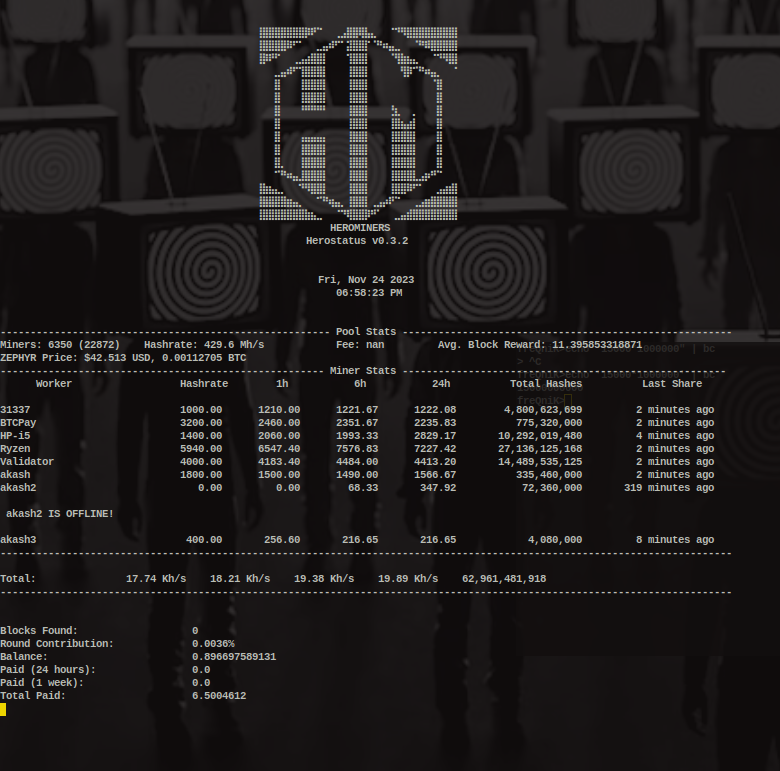

# Herostatus
Herominers Status and Alarm Notifier

This will provide an interface to monitor your miners in a terminal.
It provides current hashrate, 1h,6h, and 24 hashrates and total number of hashes.

You can set from a number of alarm types for when a miner goes down.

Currently this chceks the if the 1 hour hashrate is 0. I noticed too many false
alarms with my miners when checking if current hashrate was 0. 

# Requiremnts
```
pip3 install json
pin3 install requests
pip3 install pygame
sudo apt-get install portaudio19-dev python3-pyaudio
```


## Installation

Via pip:

```shell
pip3 install herostatus
```

Via GitHub

```shell
git clone https://github.com/freQniK/Herostatus`
cd Herostatus
python3 herostatus.py
```

Install the above requirements and run *herostatus.py* with your python 3 interpreter. 

# Usage
```shell
(hero) freQniK>herostatus -h
pygame 2.5.2 (SDL 2.28.2, Python 3.8.10)
Hello from the pygame community. https://www.pygame.org/contribute.html
usage: herostatus [-h] [-s sound] [-t times]

Herominers Crypto Status and Alarm Notifier

optional arguments:
  -h, --help            show this help message and exit
  -s sound, --sound sound
                        Choose Your Alarm: 1. Burglar Alarm (30s) 2. Car Alarm (33s) 3. Hip Hop Alarm (10s) 4. Nuclear Alarm (60s) 5. Siren Alarm
                        (16s) 6. Strong Bad Alarm (Default) (17s)
  -t times, --times times
                        Number of times to sound the alarm before it becomes annoying

```

When you first run hersostatus it will prompt for the crypto you are mining. Be sure to enter the full name of the crypto, i.e., monero, dero, ergo, zephyr, etc.

It will also prompt you for your wallet address for your miners. Finally, it will prompt you for a refresh interval. Choose wisely. These settings are stored in **~/.herostatus/config.json** and reused upon restart. 

You can edit **config.json** if you feel like it to change any settings. It's a simple file. 

# Screenshot



# Donations
Coding is a lot of work. Support your FOSS developers with a small contribution to keep them coding. Crypto is the easiest method to donate to your favorite FOSS project. 

## Bitcoin

```
bc1qjzrrqlk7t2pedfrnp25xqxru8nq3plv7ghkvag
```


## DERO
```
dero1qyxctkgzee00jh3md4etc8kxkr8x4hh7cckezrhn7de39kj4xaf9xqqa6xeta
```


## Monero

```
82sirs3qe2XCvytxCnkVyS5q6v18MN8vHgpU1hZECmnKQzzcVNB5vXiDMz1Ktdp4pgKKjK2vsWdGABN8AAtHbFAaDg7A63t
```


## Pirate Chain

```
zs1uknhdwh306h3r08l3vvd29jz0a0ym3tpxtad6j3en82g24hnzpuknuwt25r7vpsh86ly23fgjwp
```


## Zephyr
```
ZEPHs8jnJx1bKL6TdmDSfUZTMuWeFkVhye5JUg8g7QYUBizGB6u5scJixYPqLo4EQkCbjPKKxtpQJHHCEFf3qAP2QKCZBF9judW
```


